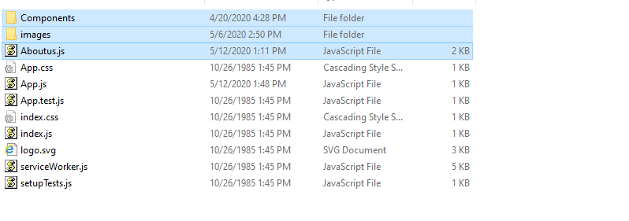
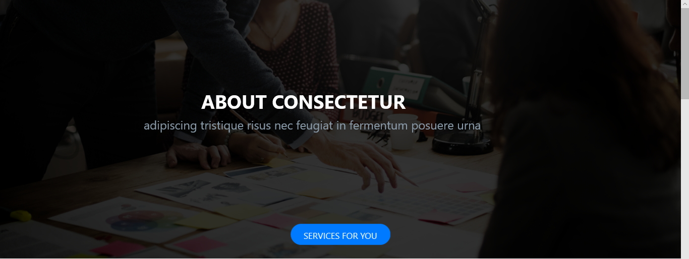
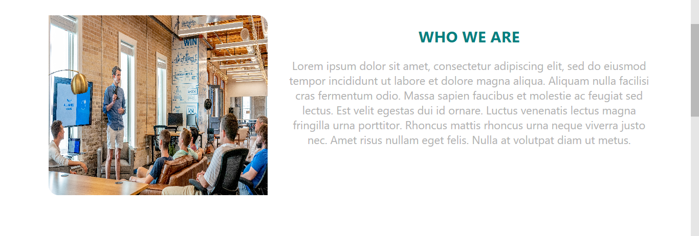
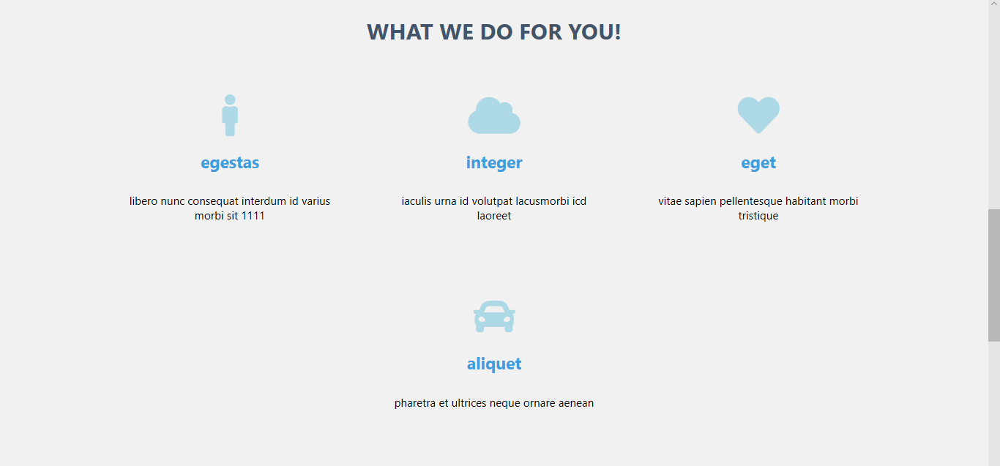

# ABOUT US REACT JS PAGE
##### This Page is a Simple ReactJS Page which demonstrates the following

   
&nbsp;&nbsp;&nbsp;&nbsp;&nbsp;&nbsp;&nbsp;&nbsp;&nbsp;&nbsp;1."Who we are" component which demonstrates the motive of company. 
&nbsp;&nbsp;&nbsp;&nbsp;&nbsp;&nbsp;&nbsp;&nbsp;&nbsp;&nbsp;2."What we do" component demonstrates the services provided by company. 
&nbsp;&nbsp;&nbsp;&nbsp;&nbsp;&nbsp;&nbsp;&nbsp;&nbsp;&nbsp;3."Our Community" component has different types of company images.  
  

## Getting Started

These instructions will get you a copy of the project up and running on your local machine for development and testing purposes.
  

## Prerequisites
###### 1 . Copy (Components,images,Aboutus.js) folders in your current projects src folder. Below are given selected files and folders to copy.

&nbsp;&nbsp;

###### 2 . Add link for Aboutus page in your project wherever it is required to be.Link will work like button ,when we will click on link it will go to Aboutus.js page and It will show this new page.
Lets take example if we want to add Link for Aboutus page from App.js  file.

###### &nbsp;&nbsp;&nbsp;&nbsp;Task- 1
&nbsp;&nbsp;&nbsp;&nbsp;copy below code in your App.js at top,this code will help to create link

&nbsp;&nbsp;&nbsp;&nbsp;import { 
&nbsp;&nbsp;&nbsp;&nbsp;&nbsp;&nbsp;&nbsp;  BrowserRouter as Router, 
&nbsp;&nbsp;&nbsp;&nbsp;&nbsp;&nbsp;&nbsp;  Switch, 
&nbsp;&nbsp;&nbsp;&nbsp;&nbsp;&nbsp;&nbsp;  Route, 
&nbsp;&nbsp;&nbsp;&nbsp;&nbsp;&nbsp;&nbsp;  Link, 
&nbsp;&nbsp;&nbsp;&nbsp;&nbsp;&nbsp;&nbsp;  useRouteMatch 
&nbsp;&nbsp;&nbsp;&nbsp;} from "react-router-dom"; 

&nbsp;&nbsp;&nbsp;&nbsp;NOTE: If  "react-router-dom" not found error occurs then go to currunt project folder on git cmd and run $ npm install --save react-router-dom

###### &nbsp;&nbsp;&nbsp;&nbsp;Task- 2
&nbsp;&nbsp;&nbsp;&nbsp;  Add link code in App.js
Refer this : 
&nbsp;&nbsp;&nbsp;&nbsp;&nbsp;&nbsp;&nbsp;&nbsp;1 . [https://knowbody.github.io/react-router-docs/api/Link.html](https://knowbody.github.io/react-router-docs/api/Link.html) 
&nbsp;&nbsp;&nbsp;&nbsp;&nbsp;&nbsp;&nbsp;&nbsp;2 . [https://www.codementor.io/@packt/using-the-link-and-navlink-components-to-navigate-to-a-route-rieqipp42 ](https://www.codementor.io/@packt/using-the-link-and-navlink-components-to-navigate-to-a-route-rieqipp42 )(this link clearifies the idea of code more clearly)

###### &nbsp;&nbsp;&nbsp;&nbsp;Task- 3
&nbsp;&nbsp;&nbsp;&nbsp;&nbsp;&nbsp;&nbsp;&nbsp;Check status of link

## Application design
Below are the some changes which we will do if we want edit accourding to uor requirnment.
 _Example_ 
To make any changes open file Aboutus.js where there are all component calls.

      <About companyname="CONSECTETUR" slogan="adipiscing tristique risus nec feugiat in fermentum posuere urna"></About>
 
Here change the companyname attributes specifies the name we want to assign for company.You can directly change the text of companyname attribute and type the text (real company name ) in that attribute.
Same with the slogan where you can write the text for slogan by erasing current text.

## Component redesign    
##### Component 1= About.js   ….Below is About.js component
&nbsp;&nbsp;

      <About companyname="CONSECTETUR" slogan="adipiscing tristique risus nec feugiat in fermentum posuere urna"></About>
 
These are code and image of how it will be displayed on the screen.Do changes in the “ (write your text)”Double quotes of companyname and slogan attribute.

##### Component 2=Whowe.js   ….Below is Whowe.js component
&nbsp;&nbsp;

      <Whowe whowetext=" Lorem ipsum dolor sit amet, consectetur adipiscing elit, sed do eiusmod tempor incididunt ut labore et dolore magna aliqua.
       Aliquam nulla facilisi cras fermentum odio. Massa sapien faucibus et molestie ac feugiat sed lectus.
       Est velit egestas dui id ornare. Luctus venenatis lectus magna fringilla urna porttitor.
       Rhoncus mattis rhoncus urna neque viverra justo nec. Amet risus nullam eget felis.
       Nulla at volutpat diam ut  metus. ">
      </Whowe>

 
These are code and image of how Whowe will be displayed on the screen.Do changes in the “ (write your text)”Double quotes of whowetext attribute.

##### Component 3=Wedo.js  Below is Wedo.js component
For this changes open file named Wedo.js.
&nbsp;&nbsp;

     <Compo icon="fa fa-male" servicename="egestas" serviceinbrief="libero nunc consequat interdum id varius morbi sit 1111">
     </Compo>
     <Compo icon="fas fa-cloud" servicename="integer " serviceinbrief="iaculis urna id volutpat lacusmorbi icd laoreet”>
     </Compo>

      <Compo icon="fas fa-heart" servicename="eget " serviceinbrief="vitae sapien pellentesque habitant morbi tristique">
      </Compo>

      <Compo icon="fas fa-car" servicename="aliquet" serviceinbrief="pharetra et ultrices neque ornare aenean">>
      </Compo>

 
There are total 4 things in What we do for you!. Same four <compo> for four blocks.
Do changes in the “ (write your text)”Double quotes of icon attribute if you want to change the first icon("fa fa-male" ) ,icon is taken from css. 
Link for icons : 
                  &nbsp;&nbsp;&nbsp;&nbsp;&nbsp;&nbsp;&nbsp;&nbsp;1 . [https://www.w3schools.com/w3css/w3css_icons.asp] (https://www.w3schools.com/w3css/w3css_icons.asp)    

Do changes in the “ (write your text)”Double quotes of servicename attribute if you want to change the first servicename ("egestas").
Do changes in the “ (write your text)”Double quotes of serviceinbrief attribute if you want to change the first serviceinbrief (“libero nunc consequat interdum id varius morbi sit 1111”).
Do same for remaining three <compo/>

##### Component 4=Community.js  Below is Wedo.js component(Here we add images which are in companies community)
&nbsp;&nbsp;

For this changes do open file named Community.js
If you want to change images from community
###### Task1 :

go in folder called images(mention in step 1) and copy paste images .
###### Task2 :

Open Community.js file.
###### Task 3:

add import statement with new added image name same as given below.

        import image1 from '../images/r2.jpg'
        import image2 from '../images/r1.jpg'

###### Task 4:

In render function add new image by using following code

        </img>
        </img>

 
Here in src={image1} image1 is referring to'../images/r2.jpg'
